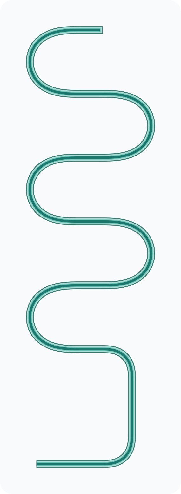
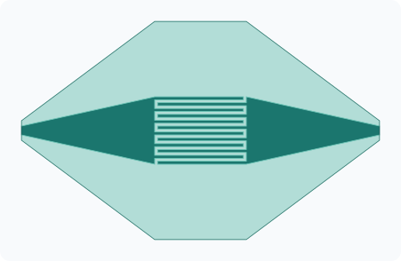
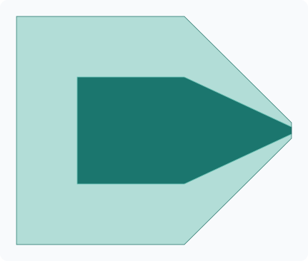
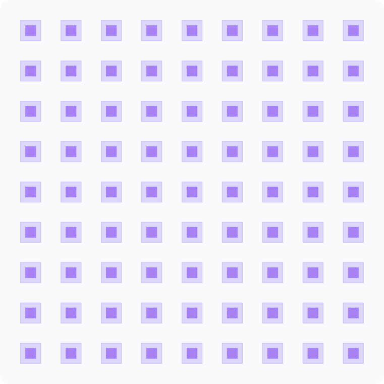
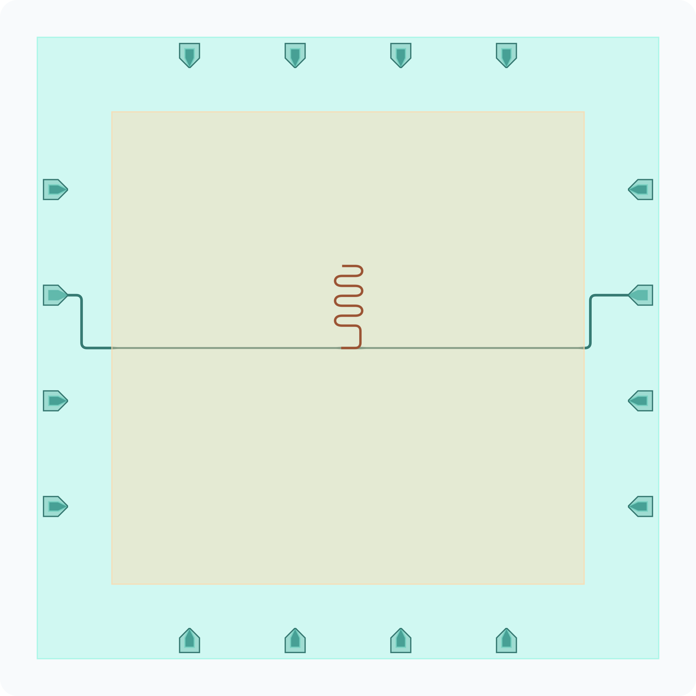
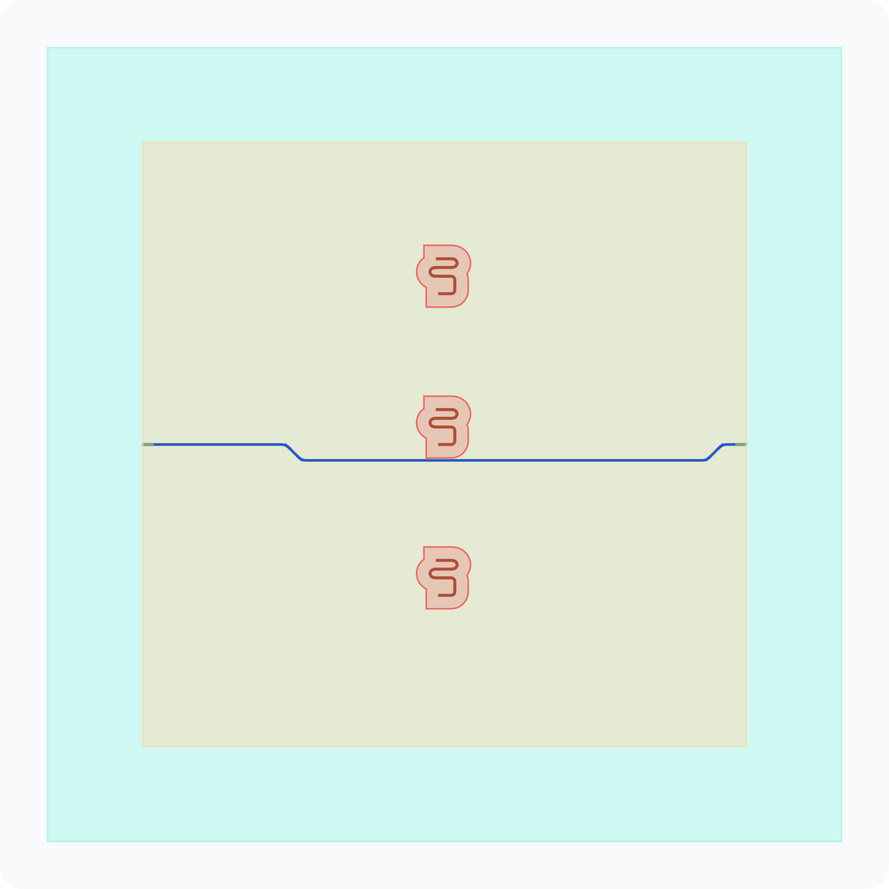
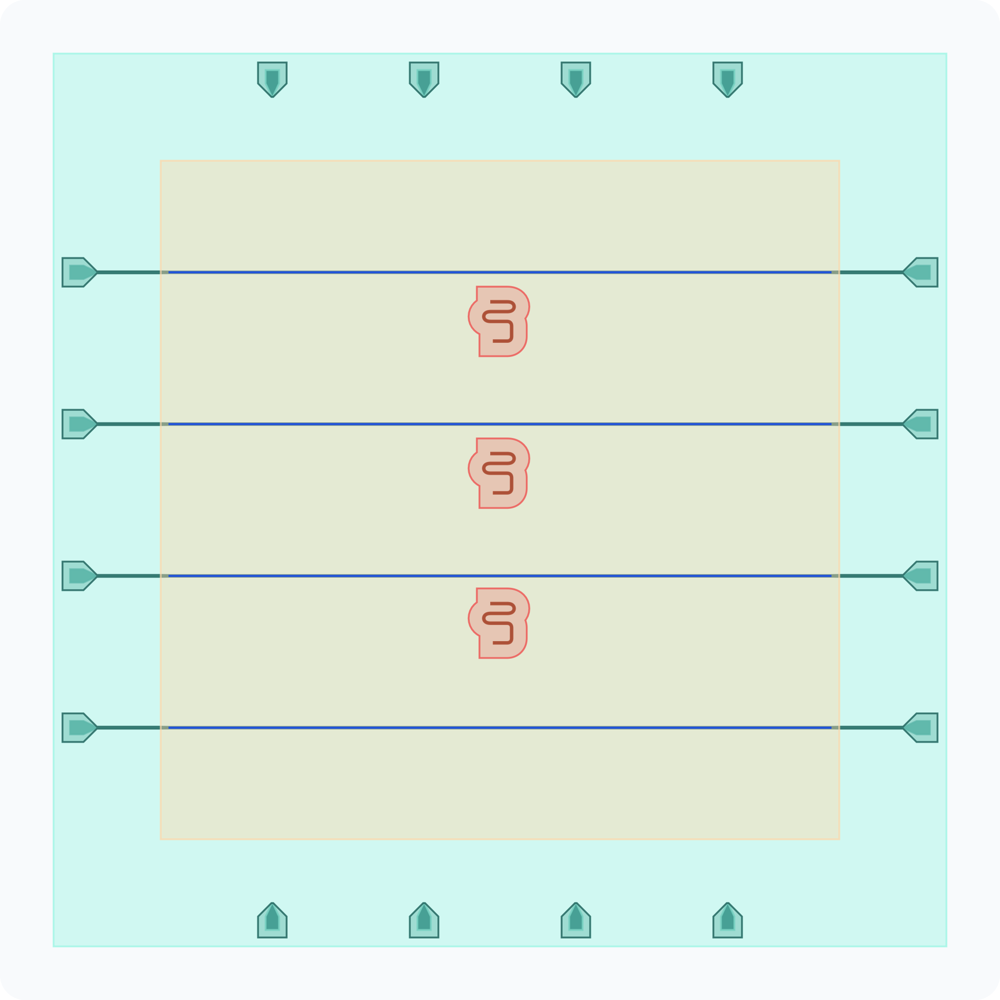

# OrPen SC PDK

<p align="center">
  
  
  
  
  
  
</p>

`orpen-sc-pdk` is OrPenStrike's public superconducting quantum/RF base PDK for
[gdsfactory](https://gdsfactory.github.io/gdsfactory/). It provides public
process layers, layer stack semantics, CPW cross-sections, passive layout cells,
flip-chip support geometry, routing helpers, and public simulation layout demos.

The boundary is deliberate: this repository contains reusable public PDK
infrastructure. Private chip designs, private qubit geometry, private parameters,
and notebook run evidence belong in private layout projects that consume this
PDK as their base PDK.

## Highlights

- **Public process contract** — `LAYER`, `LAYER_STACK`, `LAYER_VIEWS`,
  material records, connectivity, and face-aware superconducting process layers.
- **Parametric public cells** — CPW traces, resonators, launchers, tapers,
  indium bumps, dicing edges, capacitors, and benchmark geometries.
- **Flip-chip layout demos** — public resonator-based examples for distance,
  keepout, and 8-direction routing workflows.
- **Simulation metadata** — mesh-port metadata for downstream Palace, Q2D, and
  layout-to-simulation assembly.
- **GDSFactory+ integration** — registered public cells are available through
  the active PDK and can be built from GF+.

## Component Gallery

These previews are generated from the actual public `@gf.cell` factories in
this repo.

### Passive Building Blocks

| CPW Resonator | Interdigital Capacitor | Martinis 2022 Ribbon Capacitor |
| :---: | :---: | :---: |
| `resonator` | `interdigital_capacitor` | `martinis2022_differential_ribbon_capacitor` |
|  |  |  |

| Launcher | Indium Ground Field |
| :---: | :---: |
| `launcher` | `indium_ground` |
|  |  |

### Public Flip-Chip And Routing Layouts

[QPDK](https://github.com/gdsfactory/quantum-rf-pdk) shows complete
qubit-oriented examples; OrPen SC PDK keeps private qubit IP out of the public
repo and uses public resonator geometry for open routing and flip-chip
demonstrations.

| Flip-Chip Distance | Resonator Keepout Routing | Global Keepout Routing |
| :---: | :---: | :---: |
| `sim_flip_chip_distance` | `sim_flip_chip_distance_keepout_routing_demo` | `sim_flip_chip_distance_keepout_global_routing_demo` |
|  |  |  |

## Quick Start

Install the public PDK from Git:

```bash
uv init scq-layout-consumer
cd scq-layout-consumer
uv add "orpen-sc-pdk @ git+https://github.com/OrPenStrike/orpen-sc-pdk.git"
```

Activate the PDK and build a public cell:

```python
import gdsfactory as gf
import orpen_sc_pdk

orpen_sc_pdk.activate()

component = gf.get_component("resonator", length=3500)
component.show()
```

Build one of the public flip-chip routing demos:

```python
import gdsfactory as gf
import orpen_sc_pdk

orpen_sc_pdk.activate()

demo = gf.get_component("sim_flip_chip_distance_keepout_global_routing_demo")
demo.show()
```

## Repository Boundaries

| Repository | Owns |
| --- | --- |
| `orpen-sc-pdk` | Public process semantics, public cells, public layout helpers, docs, and base-PDK contracts. |
| Private layout projects | Private cells, private chip assemblies, private layout inputs, notebooks, and run evidence. |
| `gsim` | Reusable Palace/EPR/reporting workflow, benchmarks, and solver orchestration. |
| `gplugins` | Reusable gdsfactory plugin capability. |

Do not put private chip designs directly in this repository.

## Contributor Setup

Use editable sibling checkouts only when changing `orpen-sc-pdk`, `gsim`,
`gplugins`, or a private layout project together:

```toml
[dependency-groups]
ecosystem-dev = [
  "gsim",
  "gplugins",
]

[tool.uv.sources]
orpen-sc-pdk = { path = "../../orpen_sc_pdk", editable = true }
gsim = { path = "../../GDSFactory_Community_Workbench/gsim", editable = true, group = "ecosystem-dev" }
gplugins = { path = "../../GDSFactory_Community_Workbench/gplugins", editable = true, group = "ecosystem-dev" }
```

For the full local contributor environment:

```bash
uv sync -p 3.12 --extra dev --extra gdsfactoryplus --group docs --group ecosystem-dev
```

Run the focused validation checks:

```bash
uv run ruff check .
uv run ruff format . --check
uv run pytest
```

## Documentation

Build the static HTML docs:

```bash
just docs
```

Serve the built docs locally:

```bash
just serve-docs
```

The default local URL is `http://localhost:8000`. If port 8000 is already in
use, pass another port, for example `just serve-docs 8010`.
