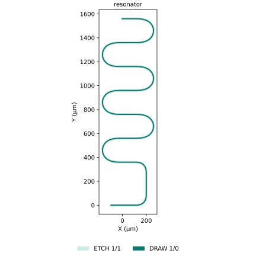
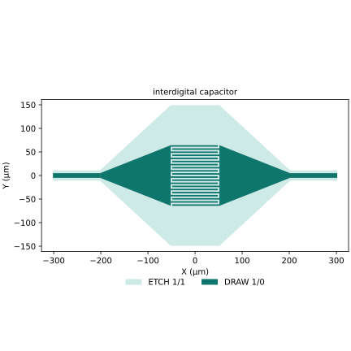
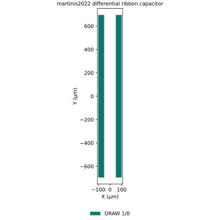
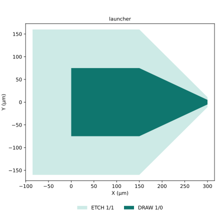

# OrPen SC PDK

<p align="center">
  
  
  
  
  
</p>

`orpen-sc-pdk` is OrPenStrike's public superconducting quantum/RF base PDK for
[gdsfactory](https://gdsfactory.github.io/gdsfactory/). It provides public
process layers, layer stack semantics, CPW cross-sections, reusable layout cells,
flip-chip support geometry, routing helpers, and public source layouts for
SCGSim testing. OrPen owns those layouts, their semantic intent and canonical
public notebooks; SCGSim owns mesh generation, native solvers and result handling.

The boundary is deliberate: this repository contains reusable public PDK
infrastructure. Private chip designs, private qubit geometry, private parameters,
and notebook run evidence belong in private layout projects that consume this
PDK as their base PDK.

## Highlights

- **Public process contract** — `LAYER`, `LAYER_STACK`, `LAYER_VIEWS`,
  material records, connectivity, and face-aware superconducting process layers.
- **Parametric public cells** — CPW traces, resonators, launchers, tapers,
  airbridges, indium bumps, dicing edges, capacitors, junctions and public Xmon
  reference geometry.
- **Public SCGSim test layouts** — pad, curved-strip, finite-CPW, flip-chip and
  airbridge source geometries with public component-simulation notebooks.
- **Simulation locators** — named GDSFactory ports and sheet geometry for SCGSim
  to compile. Mesh sizes and Palace L/C/R stay in the notebook or runtime.
- **Registered factories** — activate OrPen and build public cells through
  GDSFactory's active PDK. Project metadata declares the project and PDK names;
  it does not establish an extension SDK or live viewer installation.

## Component Gallery

These previews show current public factory defaults: deep-teal DRAW `1/0`
and soft light-teal ETCH `1/1` polygons only. Auxiliary layers are omitted; a missing
ETCH layer is not filled in.

### Passive Building Blocks

| CPW Resonator | Interdigital Capacitor | Martinis 2022 Ribbon Capacitor |
| :---: | :---: | :---: |
| `resonator` | `interdigital_capacitor` | `martinis2022_differential_ribbon_capacitor` |
|  |  |  |

| Launcher |
| :---: |
| `launcher` |
|  |

### More available public cells

| Factory | Canonical source |
| --- | --- |
| `airbridge` | [Airbridge deck and piers](orpen_sc_pdk/cells/layout/airbridge.py) |
| `indium_bump`, `indium_ground` | [Indium bump and keepout-aware field](orpen_sc_pdk/cells/layout/indium.py) |
| `kosen2024_flip_chip_xmon_qubit` | [Public Kosen 2024 Xmon reference](orpen_sc_pdk/cells/layout/qubit.py) |
| `manhattan_style_junction` | [Manhattan junction](orpen_sc_pdk/cells/layout/junction.py) |
| CPW junction, coupling sections and transitions | [CPW factories](orpen_sc_pdk/cells/layout/cpw.py) |
| Intrinsic Purcell readout resonators | [Purcell factory](orpen_sc_pdk/cells/layout/purcell.py) |

These are available source factories, not evidence of fabricated-device or
native-solver qualification. [Cells](docs/public-pdk-examples/index.md) gives
practical factory selection and flat-tag guidance; public imports and PDK names
remain unchanged.

### Public source test-layout families

| Family | Factory or canonical source | Scope |
| --- | --- | --- |
| 01 square pad | [`square_pad_capacitor`](orpen_sc_pdk/cells/simulation/simple_pad.py) | Single-die island and nonmetal locator |
| 02 circular disk | [`circular_pad_capacitor`](orpen_sc_pdk/cells/simulation/simple_pad.py) | Default inner radius is zero |
| 03 annulus | [`circular_pad_capacitor(inner_radius_um=80)`](orpen_sc_pdk/cells/simulation/simple_pad.py) | Same factory; hole is not Ground |
| 04 curved strips | [`straight_to_circular_strip`](orpen_sc_pdk/cells/simulation/simple_pad.py), [`interpolation_spline_strip`, `bspline_strip`](orpen_sc_pdk/cells/simulation/spline_strip.py) | Three distinct source definitions; no native curve-equivalence claim |
| 05 finite CPW | [`finite_ground_cpw_coupon`](orpen_sc_pdk/cells/simulation/cpw_coupons.py) | Shared source factory with explicit finite Signal and two Ground strips |
| 06 flip-chip pad | [`flip_chip_pad_coupon`](orpen_sc_pdk/cells/simulation/test_components.py) | Two dies and four bumps; source contact geometry, not native contact proof |
| 07 CPW airbridge | [`cpw_airbridge_coupon`](orpen_sc_pdk/cells/simulation/test_components.py) | CPW with airbridge deck/piers; source geometry, not native conformity proof |

The [source test-components guide](docs/public-pdk-examples/test-components.md)
records definitions and limits. Layout availability does not mean every native
test is implemented or completed. The nominal single-die base Al film is
100 nm (0.1 µm); retained results keep their original stack and provenance.

### External Reference Boundary

[QPDK](https://github.com/gdsfactory/quantum-rf-pdk) is an external
reference and public example source only. It is neither the OrPen PDK/component
authority nor the SCGSim production/runtime authority, and it is not a
production fallback. OrPen SC PDK keeps private qubit IP out of this public
repository.

## Quick Start

Install the public development line in your existing Python 3.12 or 3.13
environment:

```bash
python -m pip install "orpen-sc-pdk @ git+https://github.com/OrPenStrike/orpen-sc-pdk.git@develop"
```

This selects `develop`, not a stable release; record the resolved revision.
Follow [Get Started](docs/getting-started.md) to activate OrPen, build a public
cell and optionally open an available local viewer.

## Repository Boundaries

| Repository | Owns |
| --- | --- |
| `orpen-sc-pdk` | Public process semantics, material records, reusable cells/helpers, public SCGSim test-layout source and semantic intent, and canonical component-simulation notebooks. |
| `scgsim` | Semantic Geometry Builder Core, Palace/AEDT runtimes, handoff, resolve, and reporting. |
| Private layout projects | Private cells, chip assemblies, private inputs, notebooks, and run evidence. |

Do not put private chip designs directly in this repository.

## Contributor Setup

Install only the solver backend needed by a notebook:

```bash
uv sync -p 3.12 --group palace-notebooks
uv sync -p 3.12 --group aedt-notebooks
```

Both groups install `scgsim`; OrPen does not carry a second solver runtime.

For the declared project extras (development and the optional circuit runtime):

```bash
uv sync -p 3.12 --all-extras
```

This does not select every dependency group. Add `--group docs` or the matching
Palace/AEDT group when needed. OrPen's simulation examples consume SCGSim.

Run the focused validation checks:

```bash
uv run ruff check .
uv run ruff format . --check
uv run pytest
```

## Documentation

Build the static HTML docs:

```bash
just docs
```

Start with [Get Started](docs/getting-started.md), then choose
[Cells](docs/public-pdk-examples/index.md), [Process](docs/materials-and-technology.md)
or [Simulation](docs/notebooks.qmd). The site includes searchable API reference
pages and saved notebook content. The Cells page uses Askr's inline Image Viewer
to zoom, pan and expand the existing public SVG previews. It displays images,
not native GDS layers or semantic inspection results.
It uses the unmodified [Askr theme](docs/features/docs-theme.md), including its
default typography, reading measure and light/dark palette.

Serve the built docs locally:

```bash
just serve-docs
```

The default local URL is `http://localhost:8000`. If port 8000 is already in
use, pass another port, for example `just serve-docs 8010`.
