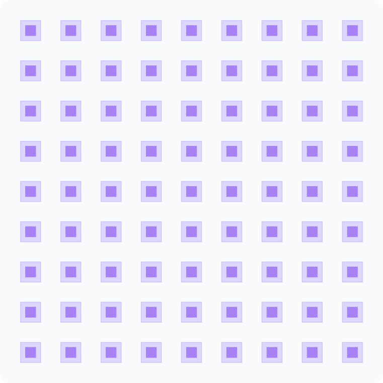

Public examples demonstrate OrPen components and PDK facts through SCGSim. They
must not duplicate solver, handoff, or report implementation inside this repo.

Choose reusable layout factories from `orpen_sc_pdk.cells` and build them by
their registered names in the active PDK. Layout sources include CPW, resonator,
capacitor, junction, qubit, airbridge and indium geometry. Simulation sources
provide public coupons and sample-only assemblies; those folder names do not
promise native solver support.

- [Component authoring](component-authoring.md) covers registered public layout
  factories.
- [Source test components](test-components.md) describes seven public source
  layout families and their native-evidence limitations.
- [Cell organization and tags](../usage/cell-organization.md) maps the current
  layout/simulation source folders and unchanged public discovery names.
- [Notebooks](../notebooks.qmd) lists the current Palace and AEDT component and
  cross-section workflows.
- [SCGSim integration](../features/scgsim-integration.md) defines the ownership
  boundary used by those notebooks.
- [Viewer guide](../layout-viewer.qmd) explains the inline controls below.

## Components Layout

Inspect five existing public SVG previews with Askr's inline Image Viewer.
Use **+ / −**, drag to pan, or **Fit**; **Expand** opens the same image in a
floating window. Closing returns to the article with the camera retained.
These are static images, not live cell builds, GDS layer inspection,
measurements or native simulation evidence.

### Resonator

[Factory source: `resonator`](https://github.com/OrPenStrike/orpen-sc-pdk/blob/develop/orpen_sc_pdk/cells/layout/resonator.py)
builds a CPW resonator from hanger and meander sections.

{#fig-layout-resonator}



### Interdigital capacitor

[Factory source: `interdigital_capacitor`](https://github.com/OrPenStrike/orpen-sc-pdk/blob/develop/orpen_sc_pdk/cells/layout/capacitor.py)
provides the reusable interdigital capacitor layout.

{#fig-layout-idc}



### Martinis ribbon capacitor

[Factory source: `martinis2022_differential_ribbon_capacitor`](https://github.com/OrPenStrike/orpen-sc-pdk/blob/develop/orpen_sc_pdk/cells/layout/martinis.py)
provides the differential ribbon capacitor layout.

{#fig-layout-martinis}



### Launcher

[Factory source: `launcher`](https://github.com/OrPenStrike/orpen-sc-pdk/blob/develop/orpen_sc_pdk/cells/layout/cpw.py)
provides the CPW launcher layout.

{#fig-layout-launcher}



### Indium ground

[Factory source: `indium_ground`](https://github.com/OrPenStrike/orpen-sc-pdk/blob/develop/orpen_sc_pdk/cells/layout/indium.py)
provides the ground-region indium bump layout.

{#fig-layout-indium}


