# Test Components Set

These seven families are public source layouts for inspecting pads, curved
strips, finite CPW and multi-level structures. The thumbnails show actual
source polygons; **Image** opens the full view and detail panels. Axes are in
micrometres. Colours distinguish positive metal, substrate footprints, masks
and nonmetal locators; they are not solver results.

| Family and source | Source-derived layout |
| --- | --- |
| **01 Square pad** — [`square_pad_capacitor()`](https://github.com/OrPenStrike/orpen-sc-pdk/blob/develop/orpen_sc_pdk/cells/simulation/simple_pad.py). Default 200 µm island and 20 µm opening gap, with a nonmetal junction locator. | 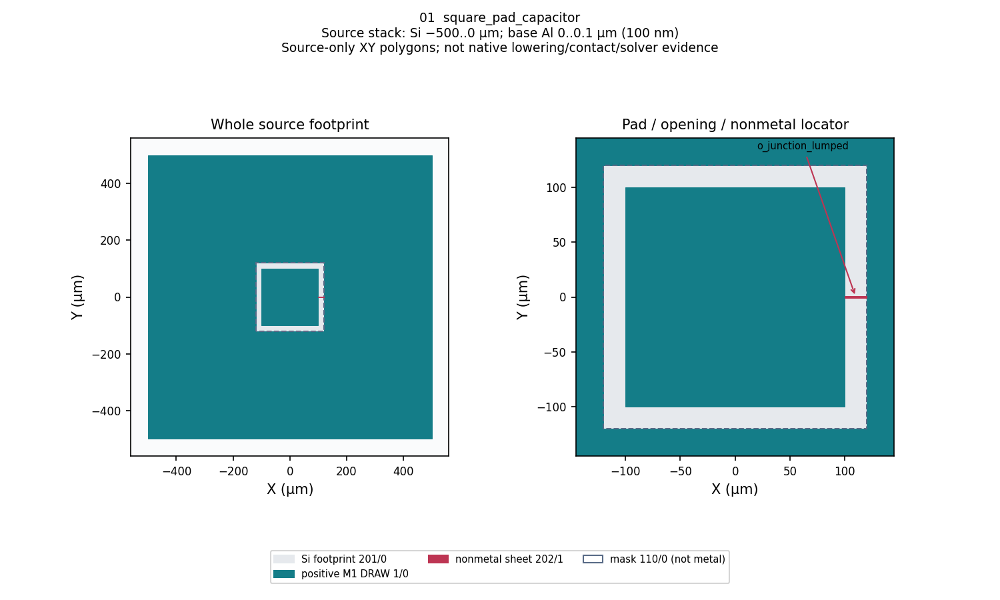{width=220}  |
| **02 Circular disk** — [`circular_pad_capacitor()`](https://github.com/OrPenStrike/orpen-sc-pdk/blob/develop/orpen_sc_pdk/cells/simulation/simple_pad.py). Outer radius 100 µm, inner radius zero. | 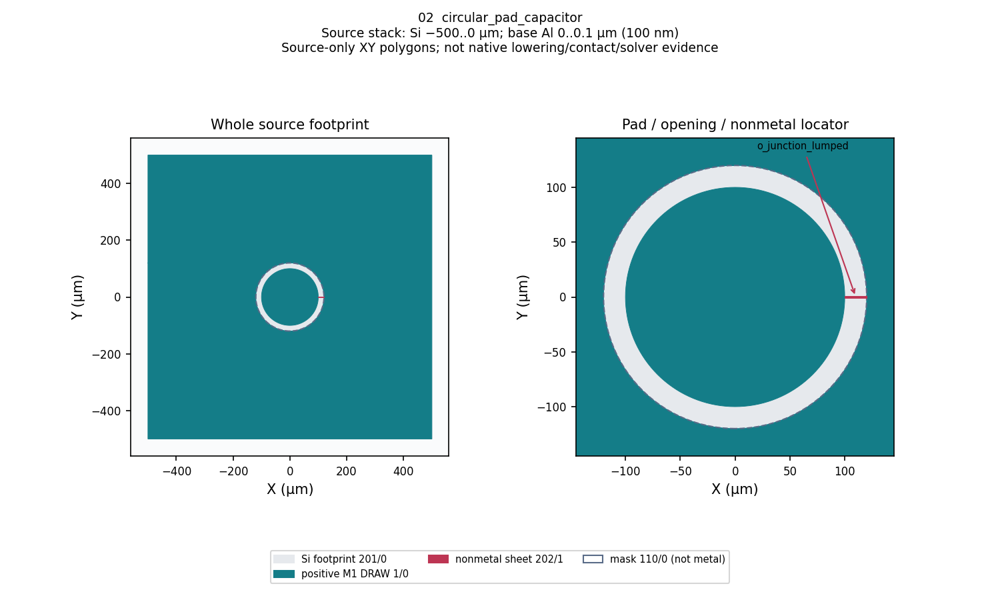{width=220}  |
| **03 Annulus** — the same circular factory with `inner_radius_um=80`. The inner hole is nonmetal, not Ground. | 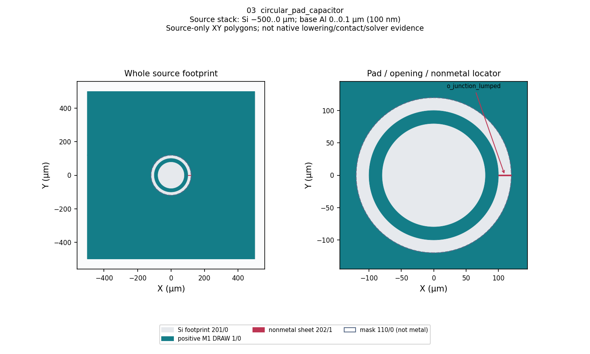{width=220}  |
| **04A Circular-arc strip** — [`straight_to_circular_strip()`](https://github.com/OrPenStrike/orpen-sc-pdk/blob/develop/orpen_sc_pdk/cells/simulation/simple_pad.py). Straight portions joined to the source circular arc; no background Ground or JJ. | 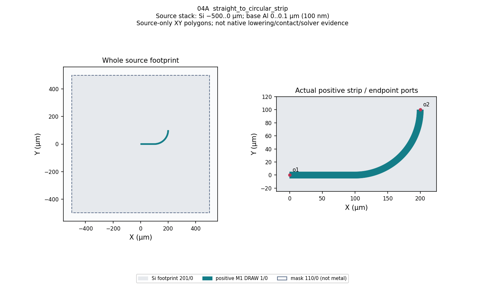{width=220}  |
| **04B Interpolation strip** — [`interpolation_spline_strip()`](https://github.com/OrPenStrike/orpen-sc-pdk/blob/develop/orpen_sc_pdk/cells/simulation/spline_strip.py). Piecewise cubic Hermite graph through the source points. | 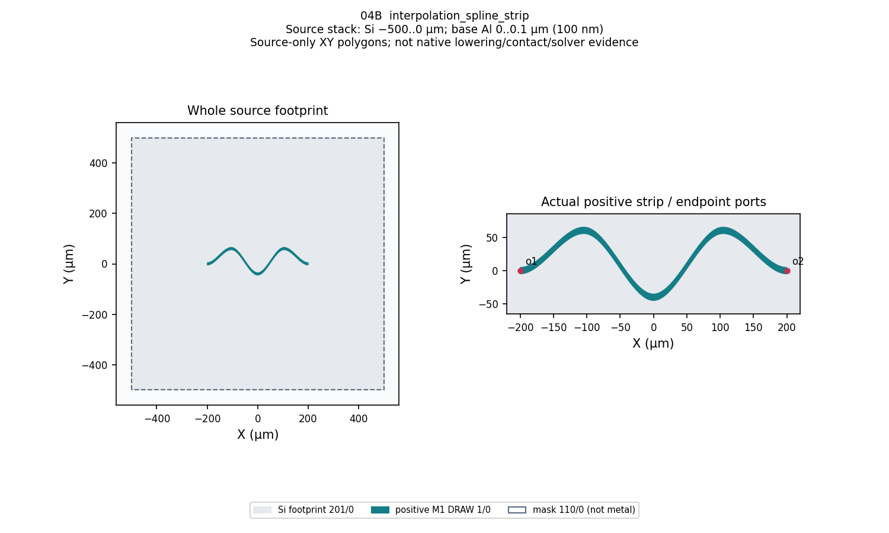{width=220}  |
| **04C B-spline strip** — [`bspline_strip()`](https://github.com/OrPenStrike/orpen-sc-pdk/blob/develop/orpen_sc_pdk/cells/simulation/spline_strip.py). Degree-three rational B-spline with explicit controls, knots and weights. | 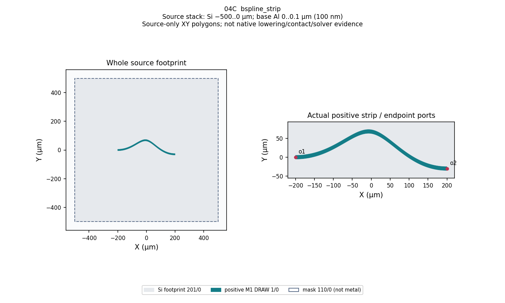{width=220}  |
| **05 Finite CPW** — `finite_ground_cpw_coupon()` in the current local source candidate. Three conductor rectangles: length 500 µm, signal 10 µm, gaps 6 µm, grounds 80 µm, on the PDK substrate. | 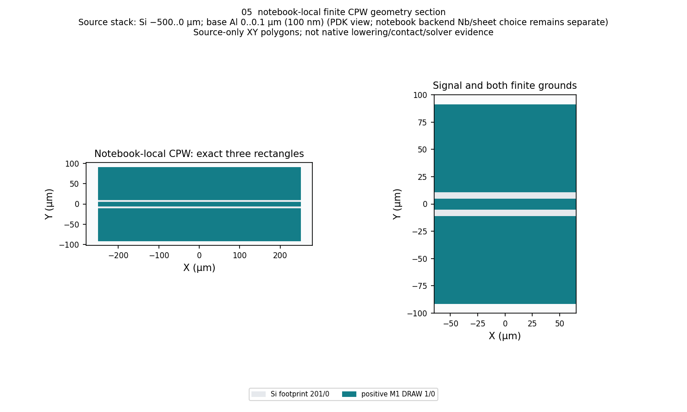{width=220}  |
| **06 Flip-chip pad** — [`flip_chip_pad_coupon()`](https://github.com/OrPenStrike/orpen-sc-pdk/blob/develop/orpen_sc_pdk/cells/simulation/test_components.py). Lower pad, full upper bottom-face plane and four existing bumps at (±250, ±250) µm. | 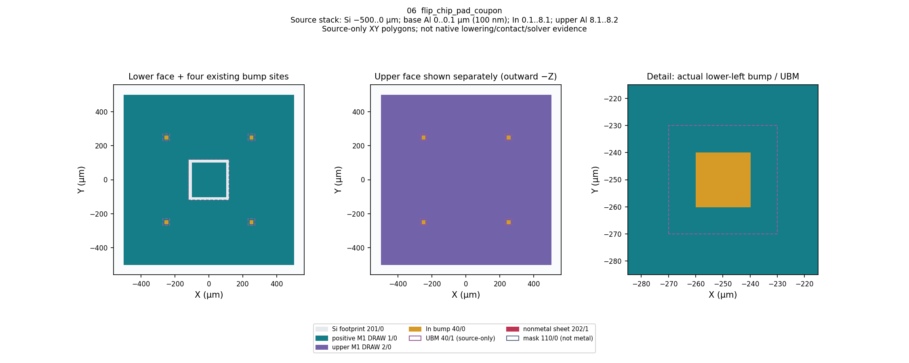{width=220}  |
| **07 CPW airbridge** — [`cpw_airbridge_coupon()`](https://github.com/OrPenStrike/orpen-sc-pdk/blob/develop/orpen_sc_pdk/cells/simulation/test_components.py). Positive CPW with the existing deck and two piers crossing above Signal. | 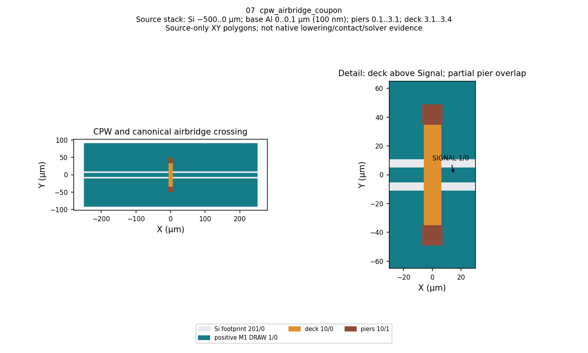{width=220}  |

## Driven Terminal: Lumped and Wave Port comparison

This selected source-layout pair uses the same through CPW, straight MTL
coupling section and short–open meander resonator. It lets readers compare
excitation geometry while keeping the resonator, Ground and airbridges fixed.
These are source geometry inspection plates, not native port assignments or
solver results.

| Layout | Source-derived inspection plate |
| --- | --- |
| **Lumped** — two launchers and internal nonmetal Signal–Ground sheets. | 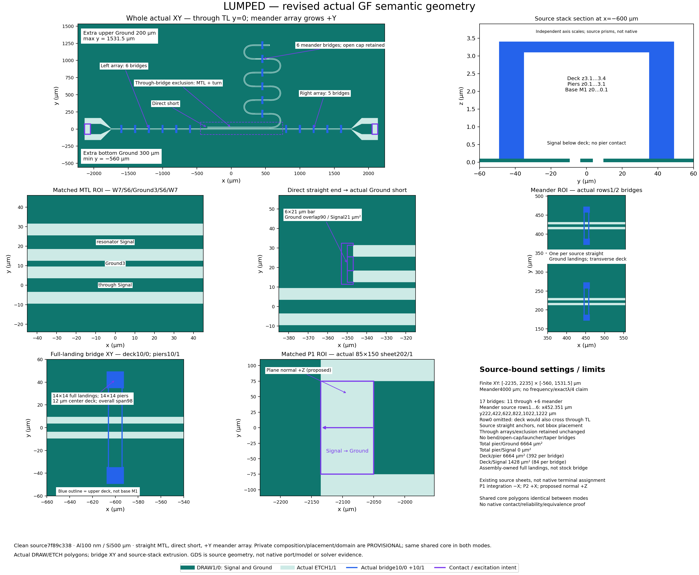{width=260}  |
| **Wave** — no launchers; constant-width CPW ends at the finite boundary. | 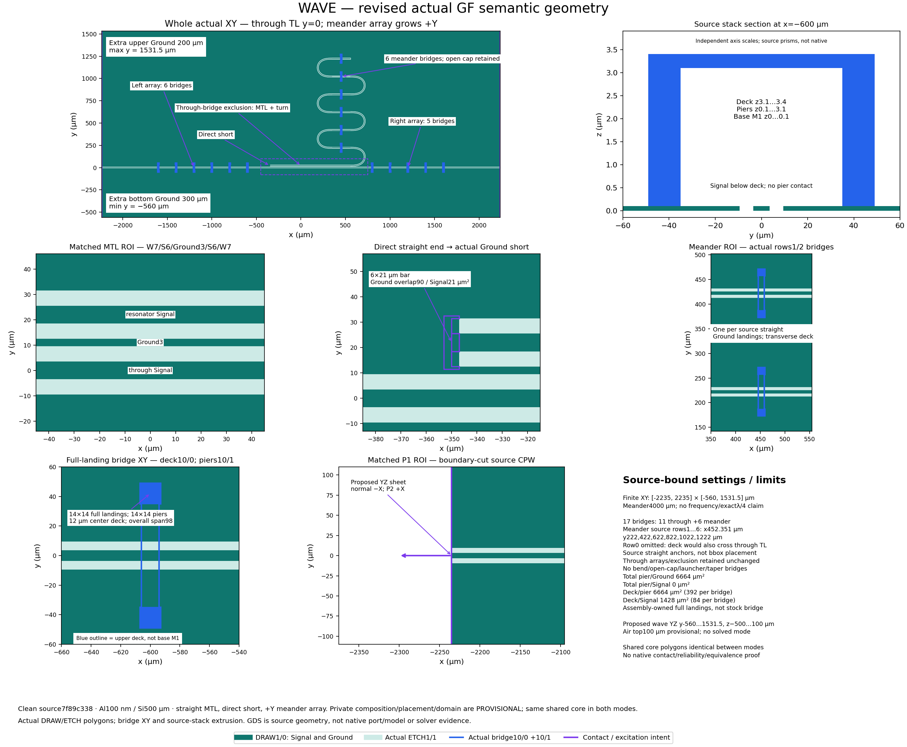{width=260}  |

| Excitation detail | Lumped | Wave |
| --- | --- | --- |
| End geometry | Launcher pads and tapers | Boundary-cut CPW; no launcher or taper |
| Sheet intent | Existing 85 × 150 µm nonmetal sheet inside each launcher end gap | Proposed exterior YZ sheet at each CPW cut |
| Proposed direction | Sheet normal +Z; integration Signal → Ground | Exterior normals −X / +X; reference Ground on both sides of Signal |
| Current status | Source sheet geometry, not an assigned native terminal | Boundary geometry and proposed wave-sheet intent, not a solved port mode |

Each layout has **17 airbridges**: 11 on constant-width through leads and six
at the canonical meander's straight-section centres. The lowest meander row
is omitted because the same bridge span would also cross the through TL.
The through bridges stay outside the coupling and adjacent-turn exclusion;
there are no bridges on launchers, tapers, bends or the open cap. Placement and
pitch are preview settings, not fabrication rules or slotline-suppression proof.

These assemblies use a 12 µm-wide central deck with **14 × 14 µm full end
landings**, covering the existing 14 × 14 µm piers. The deck's overall span is
98 µm. This assembly-owned shape differs from unchanged family 07 above,
whose stock deck only partially covers each pier. The shared source stack is
100 nm base M1, 3 µm post height above M1 and a 0.3 µm deck: posts Z =
0.1–3.1 µm, deck Z = 3.1–3.4 µm. [Process](../materials-and-technology.md)
describes the physical layers and stack.

The selected assembly from the
[public PDK source](https://github.com/OrPenStrike/orpen-sc-pdk/tree/7f89c3381097ac894705e8c54434ebfbfc758693)
is now integrated into the local candidate as
`cpw_meander_airbridge_lumped_coupon()` and
`cpw_meander_airbridge_wave_coupon()`. Both use one shared source implementation
and expose the complete body, occurrence and neutral support declarations.
The [Notebook catalog](../simulation/notebooks.qmd) links the concrete RLC and
Terminal authoring examples. This local source integration has not been published
or executed as a new native observation.
The short–open topology does not establish a target frequency, exact
quarter-wavelength design, native connectivity or Lumped/Wave equivalence.

## Build a registered source layout

```python
import gdsfactory as gf
import orpen_sc_pdk

orpen_sc_pdk.activate()
component = gf.get_component("interpolation_spline_strip")
component.write_gds("interpolation_spline_strip.gds")
# component.show()  # optional, when a compatible viewer is available
```

Use [Build and compose components](component-authoring.md) for composition and
[Process](../materials-and-technology.md) for layers, physical Z and materials.
The figures use the current public source and its 100 nm base M1 default.
Their full footprints and detail panels come from the same source polygons;
view separation does not move or redesign the components.

## Reading the curved-strip variants

04B interpolates through (−200, 0), (−100, 60), (0, −40), (100, 60), (200, 0)
µm. Endpoint slopes are zero; interior slopes use centred secants. Its source
polygon samples each Hermite span at 32 uniform parameter positions plus the
final endpoint. SCG's native OCC interpolation uses a different curve law:
matching through-points is not exact native curve equivalence.

04C uses controls (−200, 0), (−100, 0), (0, 150), (100, −30), (200, −30) µm,
degree 3, unit weights, distinct knots (0, 0.5, 1) and multiplicities (4, 1, 4).
Controls are not through-points. The source polygon uses 64 uniform parameter
samples per knot span plus the final endpoint; no fitting is performed.

Both spline strips have boundary graphs separated by 10 µm in Y, not constant
normal width. The end caps close the actual metal polygon; `o1` and `o2` follow
the endpoint tangents. The full 110/0 mask declares no background Ground.
No final electrical Nets, Ground or JJ are assigned by these strip factories.

## Reading the multi-level views

06 shows the upper face separately so its full plane does not hide the four
bumps. The upper metal is the **bottom** face of the upper die, outward −Z,
at Z = 8.1–8.2 µm. Indium bumps span 0.1–8.1 µm; the 40/1 UBM footprints
remain separate source process detail, excluded from simulation by PDK policy.
The lower child's unused nonmetal locator is not forwarded by this assembly.

07 separates Signal, the two grounds, deck 10/0 and piers 10/1 by layer. Piers
span Z = 0.1–3.1 µm and the deck 3.1–3.4 µm. Its actual deck is 12 × 84 µm
and piers are 14 × 14 µm at Y = ±42 µm: each deck/pier overlap is 12 × 7 µm,
not full pier coverage. Source contact intent is not native connectivity proof.

## Simulation scope

The [Notebook catalog](../simulation/notebooks.qmd) connects requirements to
version-bound pad/CPW authoring and source geometry observations for 04A/B/C,
06 and 07. Their current clean notebooks have no attached execution output.
These source images do not demonstrate native lowering, contact conformity,
mesh quality or solver success.

05 retains the existing rectangles and substrate. Current 3D examples use the
PDK Al stack; historical Nb/sheet outputs retain their original model. The
Q2D CPW example uses gap 10 µm and
ground 40 µm, not this 3D coupon's gap 6 µm and ground 80 µm; it is not an
automatic equivalent slice. Historical 200 nm M1 evidence retains its original
identity and is not relabelled as the current 100 nm default.
