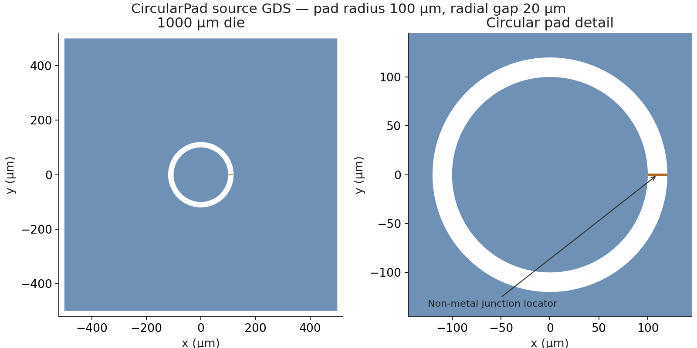

# CircularPad: curved geometry and returned eigenmode

This public synthetic electrical model has a 100 µm circular Al pad,
20 µm radial gap, 1000 µm die, 0.2 µm Al and 500 µm Si. A 2 µm-wide
non-metal junction locator defines a linear 10 nH inductive branch; no added
capacitive branch is used. These are not measured-device parameters.

Blue shows layer 1/0 electrode polygons; brown shows the layer 202/1 non-metal
junction locator, not an added metal bridge. This unchanged source-layout
image retains its original GDS identity in the manifest. It is not a fresh08
mesh, field plot or newly rendered layout.

## Mode frequency and refinement

Fresh08 (`_08`) completed one native execution, four refinement operations and
five solve/estimate snapshots. Mode 1 changes from 5.310657080530 to
**5.573354161115 GHz**. Strict receipt-bound Resolve selected the complete
final snapshot; the existing Report completed. The
[frequency/indicator CSV](frequency_amr.csv) preserves the five observations.

The final indicator is 0.1186681863426 versus the configured 0.02; native
stopped after the configured four refinements, not after demonstrating that
tolerance. This comparison is an observation, not an adequacy gate. All five
postprocessing phases emit two PCG nonconvergences at 10000 iterations
(final relative residuals 9.537e-6 and 2.349e-5). The initial external
attributes 11 and 3 also carry a natural PMC/ZeroCharge warning. Exit zero
and strict Resolve do not remove warnings or establish mesh convergence.

Final native metadata records 846008 ND unknowns and 114197 tetrahedra,
using 8 MPI processes and 1 OpenMP thread. Native elapsed time is
12080.010512229 s; reported peak node memory is 7949.05078125 MB, not current
RSS. The initial 615554 ND count is a topology estimate before constraints,
not a substitute for the final actual count.

## Interface participation

The [typed EPR CSV](typed_epr.csv) contains nine surface, two bulk and one
junction row from the existing typed mode-1 result, with normalization energy
4.169884754072e-12 J. The dominant surface contributions are:

| Interface and owner | Participation |
| --- | ---: |
| Si/vacuum SA interface | 5.722668112064e-5 |
| Pad MS bottom | 4.554037035660e-5 |
| Ground MS bottom | 1.560241834445e-5 |

Bulk participation is 0.9202311812879 in Si and 0.07976881871207 in vacuum.
The raw signed Palace junction participation is -0.9948401783541
(`signed_palace=true`); it is neither absolute-valued nor interpreted as
negative physical stored energy. Surface rows are unmasked, zero-inset
baselines. LiteratureCentral MA/MS/SA permittivity, thickness and loss inputs
are synthetic assumptions, not measured process properties. Known-loss
outputs are not device Q/T1; no accuracy or cross-solver equivalence is claimed.

## Local curved-coordinate evidence

An independently hashed surviving final boundary VTU piece contains a
source-bound representative Pad MA sidewall cell: attribute 14, rank 1,
zero-based cell 3051, bound through the input index/manifest to
`chip/PAD_OUTER/outer`. Its circumferential edge has chord length
5.050624879527886 and midnode affine displacement 0.03188684852536804 in
serialized coordinate units, versus a binary32 affine-rounding context of
7.864213995382122e-6. This supports locally non-affine/curved mapping after
four refinements, beyond merely observing VTK 69/71 or polynomial degree.

The VTU piece is independently hashed, not enumerated by the strict returned
receipt. One cell does not establish exact R100 fidelity, global geometry
accuracy, shared-node motion or internal native mesh state. No physical unit
conversion or scientific tolerance is inferred from this coordinate sample.

## Provenance and use

[run_set.json](run_set.json) binds source, input, returned receipt, sealed
analysis derivatives and public-file hashes without publishing raw logs,
native payloads or machine-local paths. Fresh08 generated its own component,
Plan, CAD, mesh, config and handoff, followed by one native execution; an
equal config hash does not imply mesh reuse. The frozen executed producer is
OrPen `c79b91ef882079d937fce20129f3cbd477e8438d`. Its sealed wheel matches
the runtime bytes of installable public SCGSim develop revision
`2eed1eb4a9bcc7b1b020feb4953d5ed27e7d7b71` (`1.1.0rc1`), not a stable
release. The later OrPen `1590199` dependency-only checkpoint and this
presentation revision were not executed as fresh08.

Corrected Palace source `4e9e1b7232b4c8ca8b964be7e70f1848f578de37` is a
prerequisite for the observed curved-port Uniform area/length surrogate,
not an exact equipotential curved-terminal voltage or measured inductance.
Use an actual MPI wrapper with `resources["command_style"] = "wrapper"`;
a direct ELF does not implement the generated `-np 8 -nt 1` interface.
The native CLI version remains unknown; source/binary hashes identify it.

The canonical QMD and derived clean IPYNB default to read-only fresh08
analysis with its retained handoff ID. Returned artifacts must already exist
locally and are not distributed here. New preparation/run actions require a
distinct fresh run ID. Historical `_04`/`_05`/`_06`/`_07` attempts remain in
Git and original artifact custody, not as parallel current lessons. This
presentation is a CONVERGING candidate, not Human scientific acceptance.
