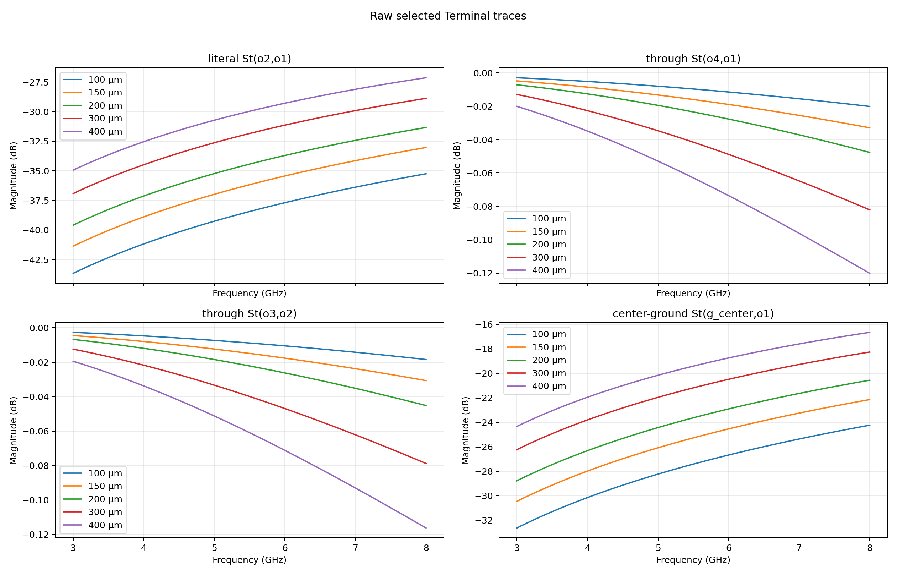
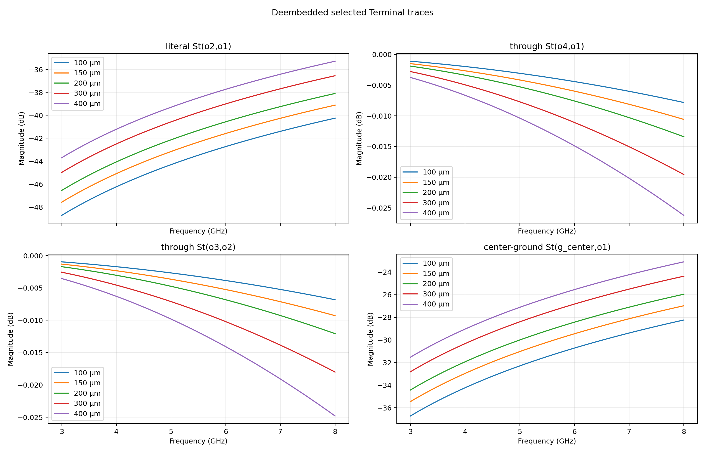
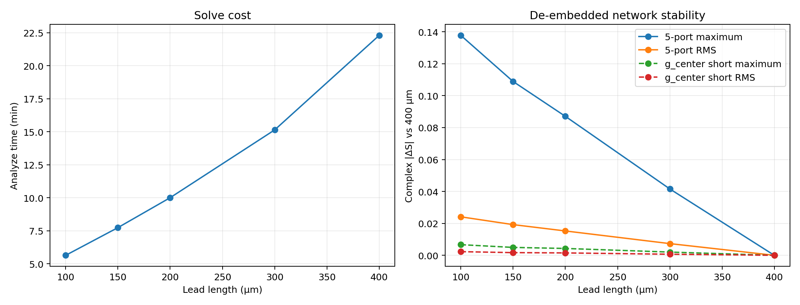
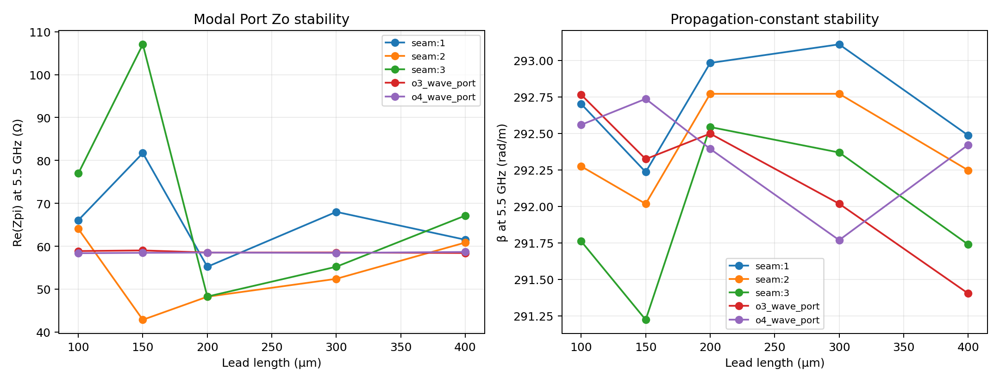
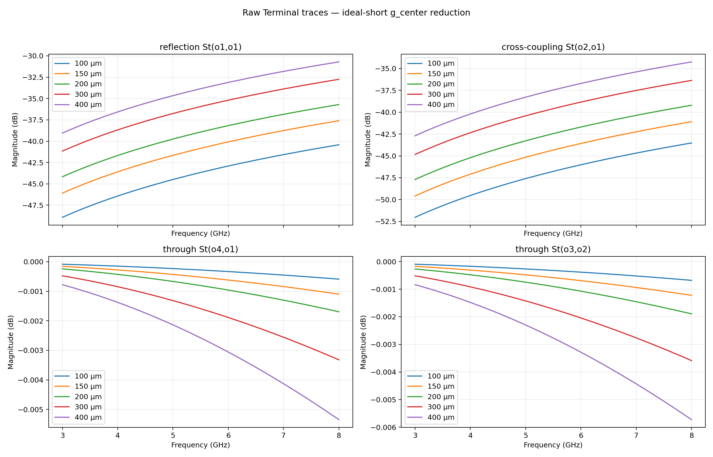
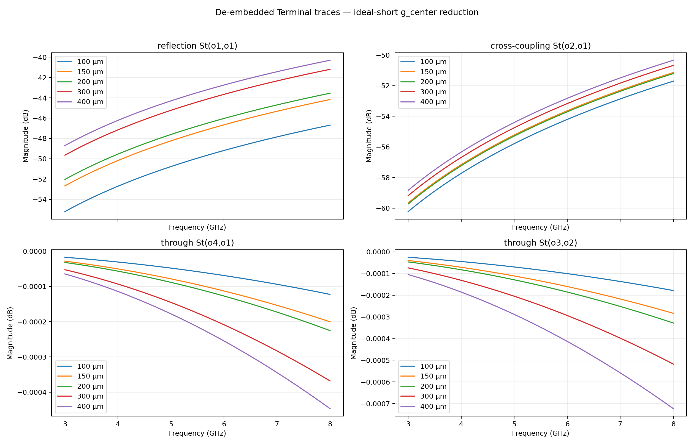

# HFSS Straight + Bend Lead-Length / De-Embedding Sweep

## Technical Summary

This five-point study compares 100, 150, 200, 300, and 400 µm uniform leads
around one straight+bend discontinuity. Every project uses the same W7/S6 CPW,
80 µm finite ground, five Terminal ports, 3–8 GHz Fast sweep with 20,000 points,
Max ΔS 0.02, Maximum ΔZo 1%, and identical conductor/ground mesh policy.

The decision question is not whether a single curve “passes” an invented
tolerance; it is how rapidly the native HFSS de-embedded network approaches the
400 µm reference while geometry and solve cost grow.

## Key Findings

The two physical signal through paths are already magnitude-stable: their
largest 300→400 µm change is only 0.0068 dB. The seam-sensitive
terms are not: `St(o2,o1)` and `St(g_center,o1)` still change by as much as
1.287 dB over the same step. The complete de-embedded 300 µm network
remains 0.0416
away from the 400 µm reference in maximum complex |ΔS|.

Modal evidence points to the seam reference plane rather than the outer CPW
ports: outer `o3/o4` Zpi stays within 58.372–59.022 Ω,
while the seam modes span 42.852–107.062 Ω across the
five leads. Therefore this sweep does **not** yet support declaring one lead
length sufficient for the complete five-terminal discontinuity model. It does
support saying that the ordinary signal through paths are stable while the
three-mode seam basis is still lead-dependent.

The aggregate deliberately shows the literal `St(o2,o1)`, the two physical
through paths `St(o4,o1)` and `St(o3,o2)`, and coupling into the explicit center
ground terminal. All 25 raw and all 25 de-embedded Terminal traces remain in each
parameter report rather than being overplotted here.

### De-embedded complex-network difference relative to 400 µm

|   lead_length_um |   max_abs_complex_s_difference_vs_400um |   rms_complex_s_difference_vs_400um |
|-----------------:|----------------------------------------:|------------------------------------:|
|              100 |                               0.137733  |                          0.0241034  |
|              150 |                               0.108868  |                          0.0192279  |
|              200 |                               0.0870525 |                          0.0152608  |
|              300 |                               0.0415667 |                          0.00733281 |
|              400 |                               0         |                          0          |

No numerical accept/reject threshold has been imposed. The table is evidence
for selecting a practical lead length, not an automatic convergence gate.

## Ideal-Short Reduction of `g_center`

The five-port Terminal network is converted to Y, `V(g_center)=0` is imposed,
and the `g_center` row and column are removed. This is an ideal short to the
existing reference ground, not a matched termination. The resulting four-port
order is `o1, o2, o3, o4`; no FEM solve is repeated.

For the 300→400 µm step, the largest physical-through magnitude change after
short reduction is 0.0002 dB; the largest selected
reflection/cross-coupling change is 0.9428 dB. The complete
short-reduced 300 µm network differs from the 400 µm reference by
0.0020 in maximum complex |ΔS|.

### De-embedded short-reduced difference relative to 400 µm

|   lead_length_um |   max_abs_complex_s_difference_vs_400um |   rms_complex_s_difference_vs_400um |
|-----------------:|----------------------------------------:|------------------------------------:|
|              100 |                              0.00667066 |                         0.00229827  |
|              150 |                              0.00495239 |                         0.00168451  |
|              200 |                              0.00429613 |                         0.00150211  |
|              300 |                              0.00202832 |                         0.000684264 |
|              400 |                              0          |                         0           |

These values remain comparative evidence; no automatic lead-length acceptance
threshold has been introduced.

## Simulation Performance / Benchmarks

|   lead_length_um |   analyze_setup_seconds |   completed_adaptive_passes |   max_tetrahedra |   max_matrix_size_dof_proxy | adaptive_max_memory_per_process   |   final_max_mag_delta_s |
|-----------------:|------------------------:|----------------------------:|-----------------:|----------------------------:|:----------------------------------|------------------------:|
|              100 |                 338.489 |                           3 |           208738 |                     1258861 | 8.86 GB                           |             0.000474257 |
|              150 |                 464.43  |                           3 |           306347 |                     1847189 | 12.5 GB                           |             0.0031048   |
|              200 |                 600.478 |                           3 |           386460 |                     2322477 | 14.9 GB                           |             0.00213277  |
|              300 |                 908.488 |                           3 |           592961 |                     3554135 | 21.1 GB                           |             0.00395774  |
|              400 |                1338.02  |                           3 |           827955 |                     4937743 | 28.7 GB                           |             0.00594799  |

`max_matrix_size_dof_proxy` is the exact HFSS profile label “Max matrix size”.
HFSS did not export a separate total DoF field, so the report does not relabel
this proxy as an exact degree-of-freedom count.

## Scope and Quantity Definitions

- Terminal order: `o1, o2, g_center, o3, o4`.
- Raw S is exported from the solved project after disabling `DoDeembed` on all
  three physical wave ports; this is a post-processing change and does not rerun FEM.
- De-embedded S is exported after restoring each port's native positive lead
  de-embedding distance.
- `St(destination, source)` is Driven Terminal scattering data.
- Modal Port Zo is Zpi because no impedance line is assigned.
- Gamma is extracted from `Setup1 : LastAdaptive`; α is Np/m and β is rad/m.

## De-Embedding Method

In the independent modal basis, a uniform lead gives

`S_raw,ij = exp(-gamma_i * li) * S_DUT,ij * exp(-gamma_j * lj)`.

Moving both reference planes toward the discontinuity therefore removes those
propagation factors. HFSS performs this operation natively using the complex
port propagation constants and lead distances. Because the reported network is
then transformed into a five-terminal basis with three modes at the seam, an
individual Terminal `St(...)` element need not behave like a single uncoupled
scalar mode; magnitude as well as phase can change through modal/terminal basis
mixing.

HFSS documents wave-port de-embedding as a reference-plane post-process and
defines Gamma as α+jβ with α in Np/m and β in rad/m:

- https://ansyshelp.ansys.com/public/Views/Secured/Electronics/v251/en/Subsystems/HFSS/Content/HFSS/DeembeddedSMatricesinHFSS.htm
- https://ansyshelp.ansys.com/public/Views/Secured/Electronics/v251/en/Subsystems/HFSS/Content/HFSS/ComplexPropagationConstant.htm

## Limitations and Robustness

- The longest lead is used only as the comparison reference; it is not declared
  ground truth.
- Gamma is available from the final 5.5 GHz adaptive solution, whereas Modal
  Port Zo is available over the 20,000-point Fast sweep.
- The derived phase velocity/effective permittivity assume quasi-TEM interpretation.
- This report covers the straight+bend topology only. Bend+bend requires its own sweep.

## Recommended Next Step

Use the ideal-short reduction only if the final layout ties `g_center` to the
reference ground over the relevant bandwidth. If that physical contract holds,
select the practical lead from the short-reduced evidence; otherwise replace the
ideal short with the actual ground-connection network before fitting a reusable
S-matrix model.

## Per-Parameter Reports

- [100 µm](../lead_100um/report.md)
- [150 µm](../lead_150um/report.md)
- [200 µm](../lead_200um/report.md)
- [300 µm](../lead_300um/report.md)
- [400 µm](../lead_400um/report.md)
