# Straight + Bend Transition — Lead 300 µm

## Configuration

- Terminal order: `o1, o2, g_center, o3, o4`
- Lead/de-embed length: 300 µm
- Finite ground width: 80 µm
- HFSS Driven Terminal; seam has three terminal modes, outer ports one each
- 3–8 GHz Fast sweep, 20,000 points; Max ΔS 0.02; Max ΔZo 1%; 30 cores; RAM limit 45%

## Geometry

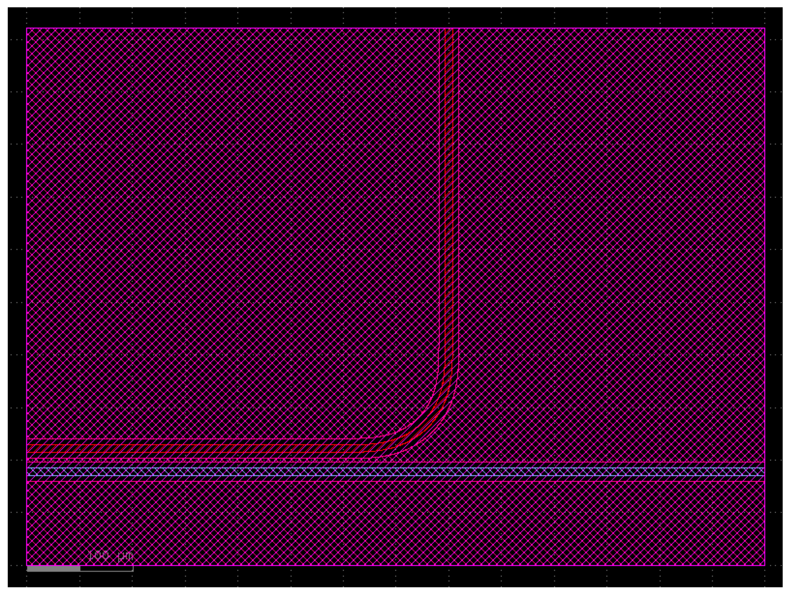

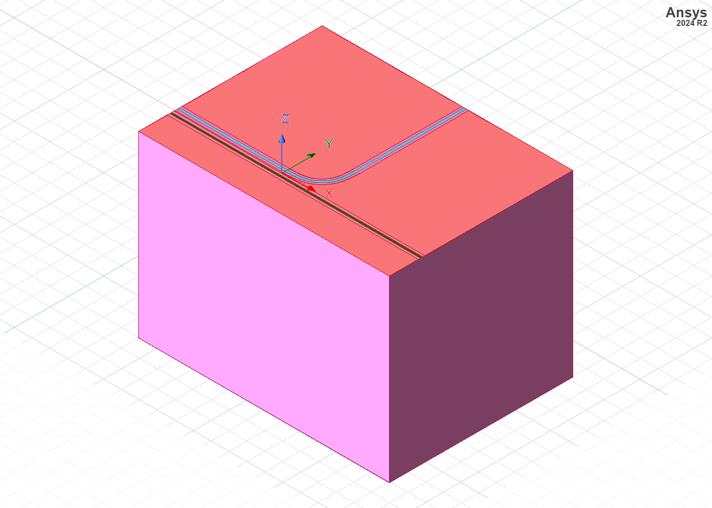

## Complete Terminal Scattering Matrix

Raw magnitude and phase:

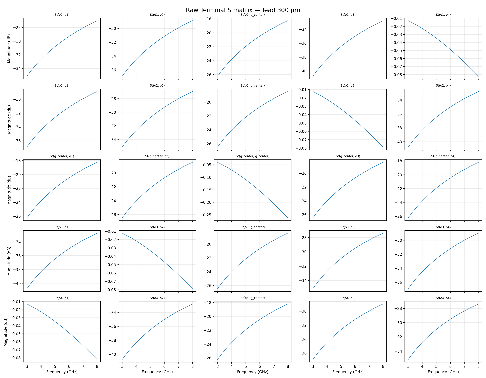

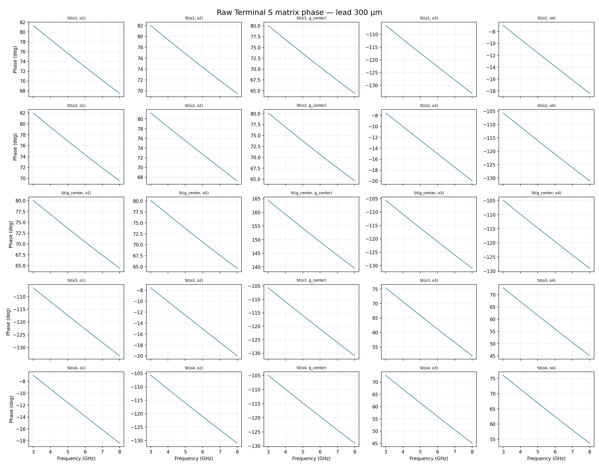

De-embedded magnitude and phase:

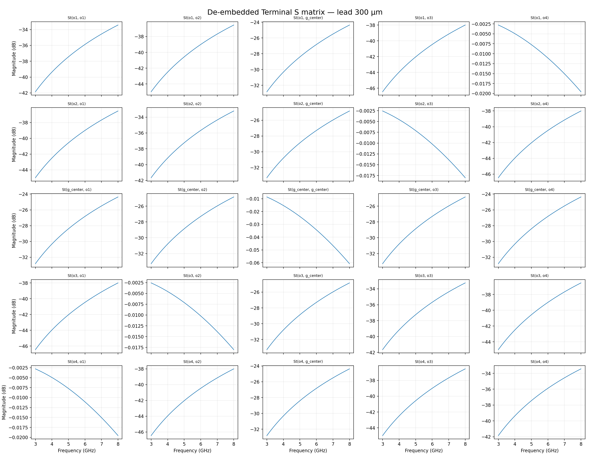

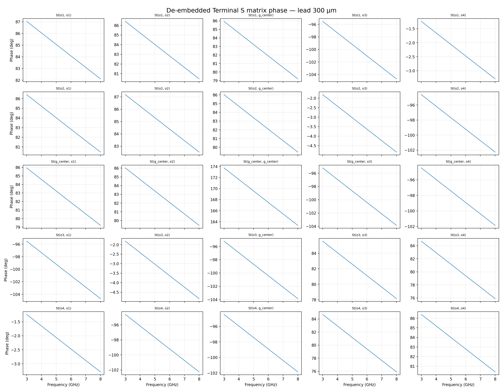

The literal `St(o2,o1)` mean magnitude is -32.184 dB raw and
-40.075 dB after native HFSS wave-port de-embedding. The two
physical trace-through paths are `St(o4,o1)` and `St(o3,o2)`; `St(o2,o1)` is
the seam cross-coupling term, not a through path.

## Ideal-Short Reduction of `g_center`

The explicit center-ground terminal is terminated with `V(g_center)=0` in the
network Y-matrix. The resulting four-port order is `o1, o2, o3, o4`.

Raw short-reduced magnitude and phase:

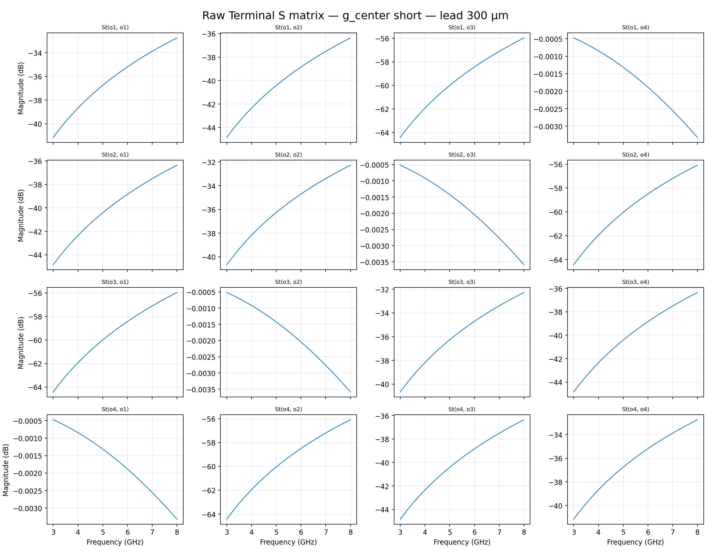

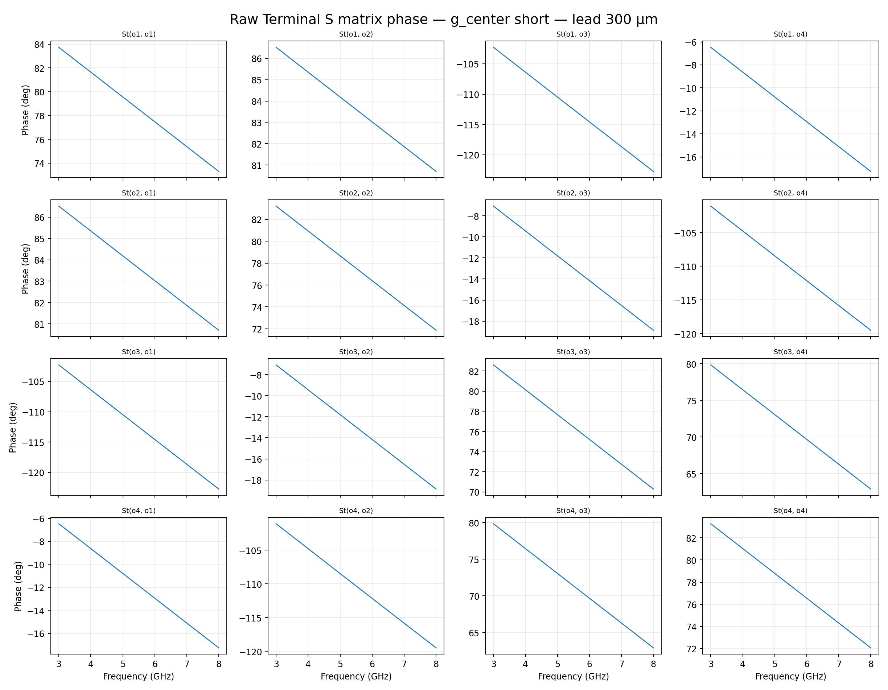

De-embedded short-reduced magnitude and phase:

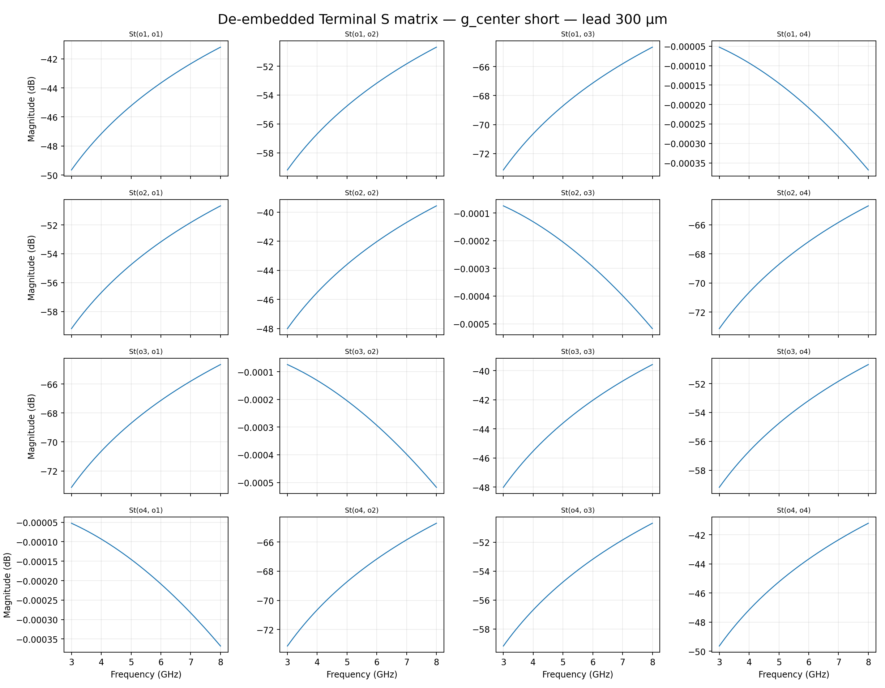

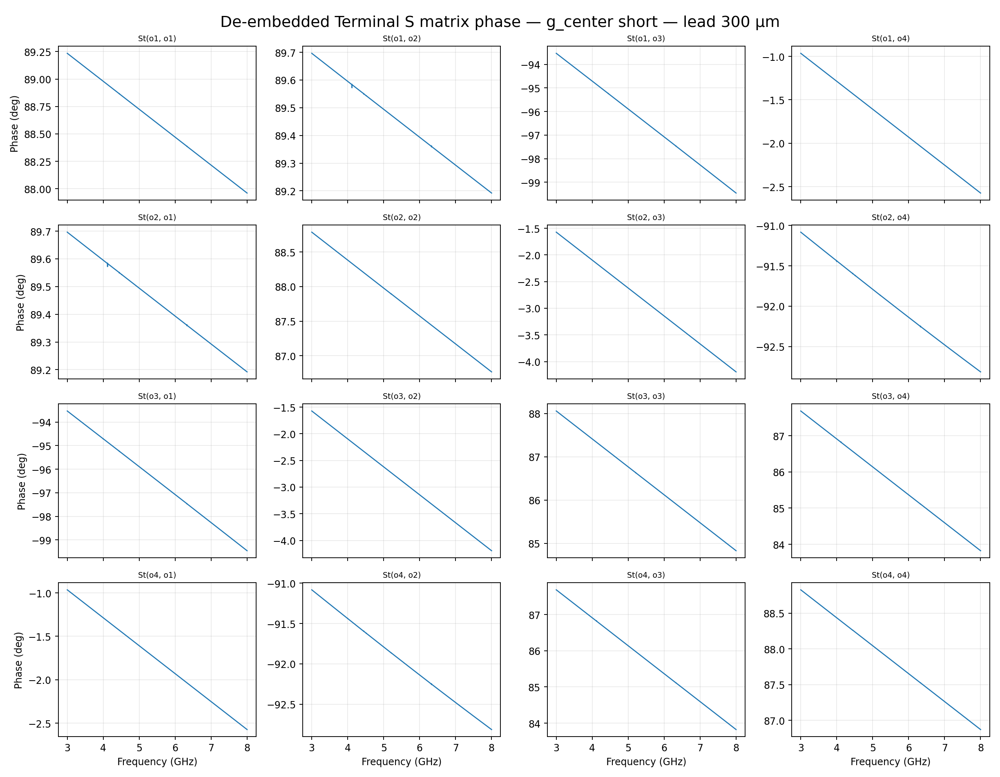

## Mode Characteristics

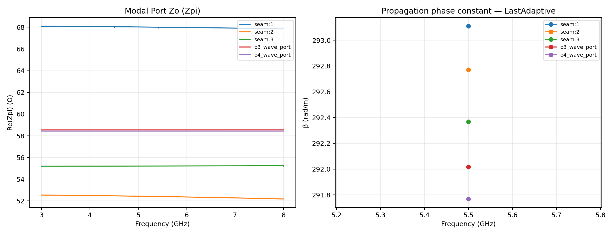

`modal_zpi_full_sweep.csv` contains HFSS Modal Solution Data / Port Zo (Zpi).
`modal_characteristics_last_adaptive.csv` contains each physical wave-port mode's
Gamma, with α in Np/m and β in rad/m, plus derived phase velocity and quasi-TEM
effective permittivity. The seam mode order is mapped to `o1`, `o2`, and
`g_center` according to the terminal creation order.

## Simulation Cost

- Notebook analyze call: 908.488 s
- Adaptive passes: 3
- Max tetrahedra: 592,961
- HFSS max matrix size (DoF proxy): 3,554,135
- Final Max Mag ΔS: 0.00395774
- Adaptive max memory/process: 21.1 GB
- Frequency-sweep total memory: 23.2 GB

HFSS did not emit a separately labelled total “Degrees of Freedom” field in the
profile; this report therefore preserves the solver-labelled matrix size as the
DoF proxy rather than relabelling it as an exact DoF count.

## Files

- `raw_terminal.s5p`: complete raw complex Terminal network
- `deembedded_terminal.s5p`: complete native HFSS de-embedded Terminal network
- `raw_g_center_short.s4p`: raw four-port network after ideal-short reduction
- `deembedded_g_center_short.s4p`: de-embedded four-port network after ideal-short reduction
- `modal_zpi_full_sweep.csv`: full-frequency modal Zpi
- `modal_characteristics_last_adaptive.csv`: Gamma and derived modal quantities
- `adaptive_pass_cost.csv`: pass-by-pass tetrahedra, matrix size, and ΔS
- `straight_bend_lead300um_ground80um_deembed300um_dzo1pct_terminalmodes_seam5p.aedt`: solved AEDT project
- `straight_bend_lead300um_ground80um_deembed300um_dzo1pct_terminalmodes_seam5p.gds`: GDSFactory-exported coupon
